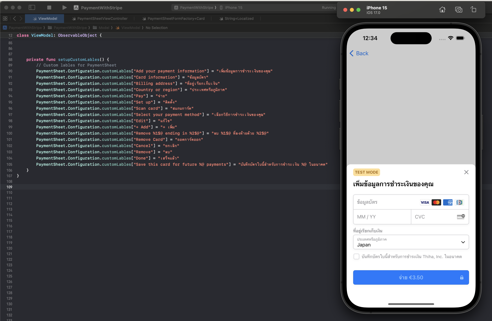
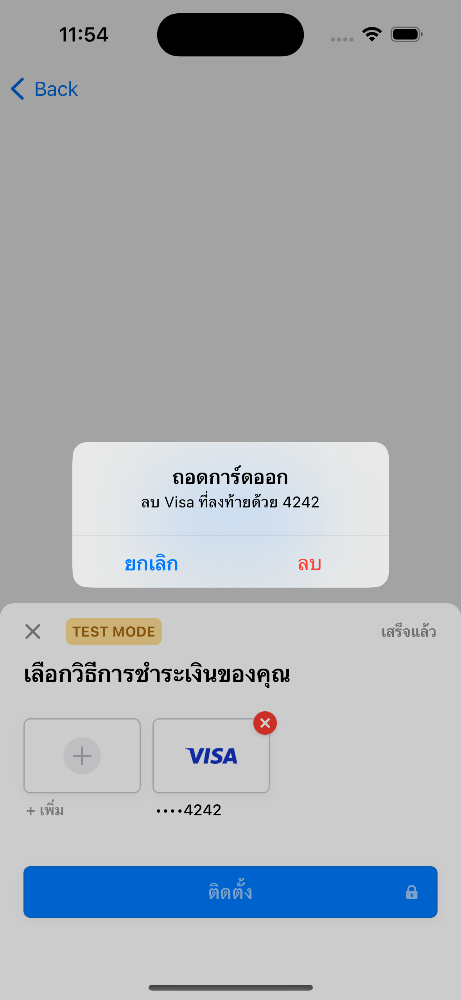
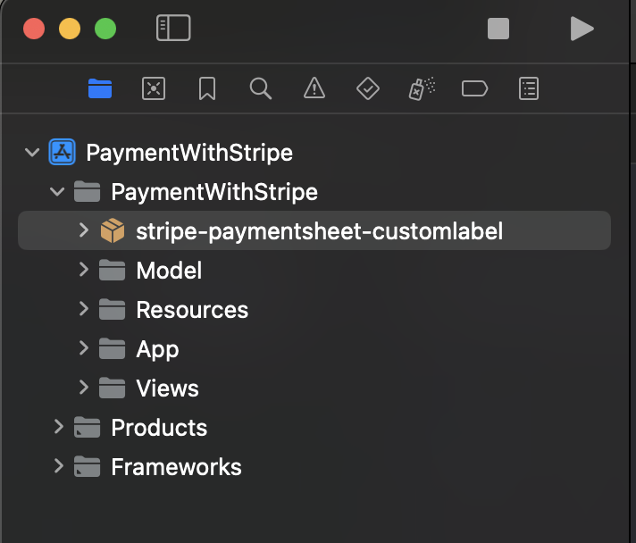
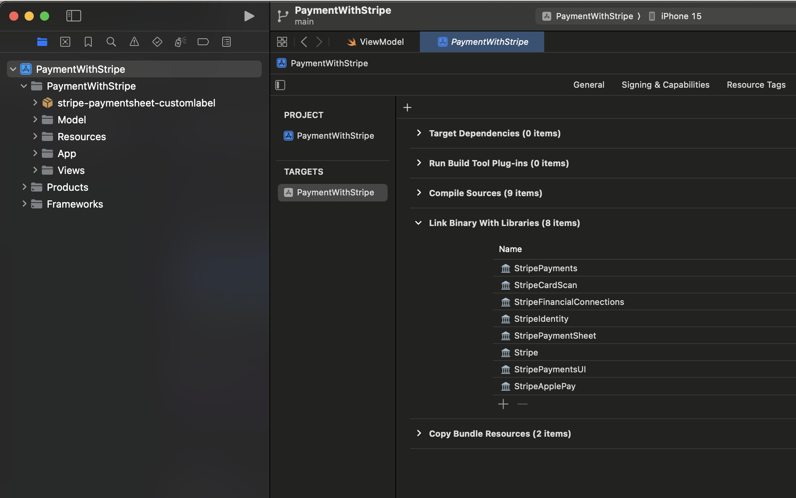
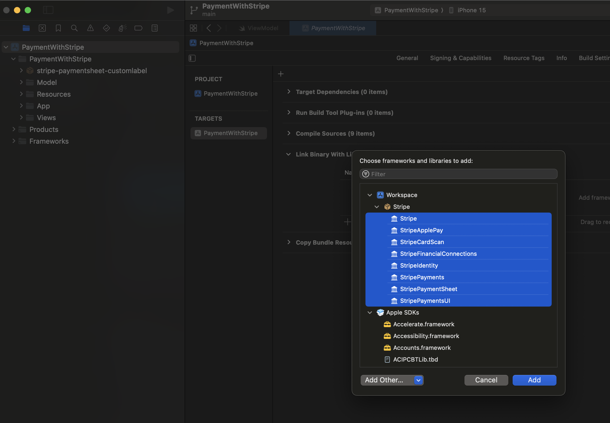

# Stripe iOS SDK with custom lables

* Replace with your local language string in Stripe PaymentSheet 
* Only works as local SPM package at the moment.

 

## How to install
* Clone the SDK project
* Drag SDK project to your host project.
* Choose frameworks in Link Binary with Libraries

## Licenses

- [Stripe iOS SDK License](LICENSE)
